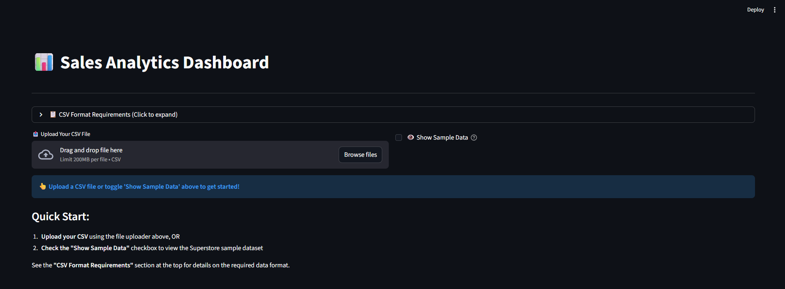
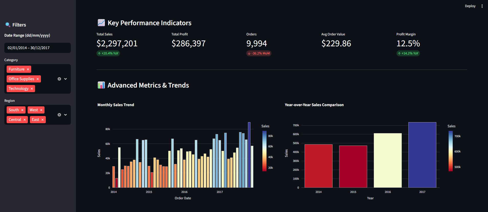
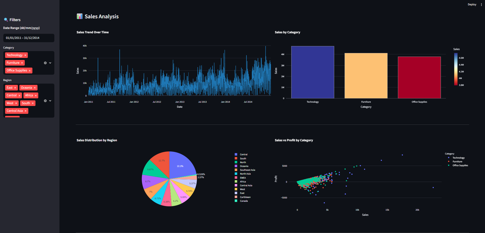

# Sales Analytics Dashboard

A professional Streamlit sales analytics dashboard demonstrating clean architecture, comprehensive testing, and production-ready code quality.

## 🚀 Live Demo

**[View Live Dashboard](https://sales-dashboard-app-apqgm8pdigxzwfgqoytteg.streamlit.app/)**

Upload your own CSV file or use the sample Superstore dataset to explore the dashboard.

## 📸 Screenshots

### Home Screen

*Upload your CSV file or use the sample Superstore dataset with comprehensive format support*

### Sales Analytics & Trends

*Interactive visualizations including yearly trends, monthly patterns, and category breakdowns*

### Detailed Performance Metrics

*Regional performance, top products, and customer analysis with dynamic filtering*

## Features

- **CSV Upload & Validation**: Multi-delimiter support (comma, semicolon, tab, pipe), multi-encoding (Latin-1, ISO-8859-1, CP1252, UTF-8) with automatic detection
- **Dynamic Filtering**: Date range, category, region filters with responsive updates
- **Key Metrics**: YoY growth, MoM changes, profit margins with dynamic year/month comparison
- **Visualizations**: 8 different chart types (trend, category, region, scatter, monthly, yearly, top products/customers)
- **Responsive Layout**: Dynamic grid layouts that auto-fill empty spaces
- **Data Integrity**: All data comes exclusively from uploaded CSV
- **Modular Architecture**: Clean separation of concerns (data, calculations, visualization, utils)
- **Professional Codebase**: SOLID principles, proper error handling, custom exceptions

## Tech Stack

- **Frontend**: Streamlit
- **Data**: Pandas, Plotly
- **Python**: 3.13

## Installation

**Production Setup:**
```bash
python -m venv sales_venv
.\sales_venv\Scripts\activate
pip install -r requirements.txt
```

**Development Setup (includes testing tools):**
```bash
python -m venv sales_venv
.\sales_venv\Scripts\activate
pip install -r dev-requirements.txt
```

## Running the App

`bash
streamlit run app.py
`

## Testing

**Run all tests:**
```bash
pytest
```

**Run with coverage:**
```bash
pytest --cov=calculations --cov=data --cov=utils --cov=visualization --cov-report=html
```

**Specific test categories:**
```bash
pytest tests/unit -v          # Unit tests (61)
pytest tests/integration -v   # Integration tests (7)
pytest tests/ui -v            # UI tests (30)
```

**Current Status**: 93/98 tests passing (94.9%) | 85.95% code coverage | GitHub Actions CI/CD active

See [tests/README.md](tests/README.md) for detailed testing guide.

## CSV Requirements

**Required Columns:**
- Order Date (dates in DD/MM/YYYY, DD-MM-YYYY, or YYYY-MM-DD format)
- Sales (numeric values)

**Optional Columns:**
- Profit (numeric)
- Category (text)
- Region (text)
- Product Name (text)
- Customer Name (text)

## Sample Data

Includes Superstore sample dataset (2015-2016 data) for demonstration.

## Project Structure

```
sales-dashboard-streamlit/
├── app.py                           # Streamlit UI & data orchestration
├── requirements.txt                 # Production dependencies
├── dev-requirements.txt             # Development & testing dependencies
├── README.md                        # This file
├── .gitignore                       # Git ignore rules
├── pytest.ini                       # Pytest configuration
├── .coveragerc                      # Coverage configuration
├── Sample - Superstore.csv          # Sample dataset (2015-2016 Superstore data)
│
├── .streamlit/                      # Streamlit Cloud configuration
│   └── config.toml                  # Streamlit theme & display settings
│
├── data/                            # Data loading & validation module
│   ├── __init__.py
│   ├── loader.py                    # CSV parsing, delimiter/encoding detection
│   └── validators.py                # Data validation functions
│
├── calculations/                    # Metrics & aggregations module
│   ├── __init__.py
│   ├── metrics.py                   # YoY/MoM growth calculations (pure functions)
│   └── aggregations.py              # Cached aggregation queries (@st.cache_data)
│
├── visualization/                   # Chart creation & layout module
│   ├── __init__.py
│   ├── charts.py                    # Individual chart creators
│   └── layout.py                    # Dynamic grid layout renderer
│
├── utils/                           # Utility module
│   ├── __init__.py
│   ├── exceptions.py                # Custom exception classes
│   └── formatters.py                # Formatting utilities
│
├── tests/                           # Comprehensive test suite (Phase 2)
│   ├── conftest.py                  # Pytest fixtures (14 reusable)
│   ├── pytest.ini                   # Pytest configuration
│   ├── README.md                    # Testing guide
│   ├── unit/                        # 61 unit tests
│   │   ├── test_metrics.py          # YoY/MoM calculations (14 tests)
│   │   ├── test_aggregations.py     # Data aggregations (22 tests)
│   │   ├── test_validators.py       # Data validation (21 tests)
│   │   └── test_loader.py           # Data loading (10 tests)
│   ├── integration/                 # 7 integration tests
│   │   └── test_data_pipeline.py    # End-to-end workflows
│   ├── ui/                          # 30 UI tests
│   │   └── test_charts.py           # Chart rendering with mocks
│   └── fixtures/
│       ├── sample_data.py           # Data generators
│       └── __init__.py
│
├── .github/
│   └── workflows/
│       └── tests.yml                # GitHub Actions CI/CD pipeline
│
└── sales_venv/                      # Virtual environment (excluded from git)
```

**Architecture**: Modular design with clear separation of concerns:
- **data/**: Handles all file I/O and data validation
- **calculations/**: Pure calculation functions + cached aggregations
- **visualization/**: Chart creation and layout rendering
- **utils/**: Exceptions, formatters, and shared utilities

## Future Improvements (Roadmap)

- [x] **Phase 1**: Modularize codebase (✅ COMPLETED)
  - ✅ Separated data/, calculations/, visualization/, utils/ modules
  - ✅ Implemented SOLID principles for scalability
  - ✅ Clean module imports with dedicated __init__.py files
  - ✅ Updated app.py to use modular structure
  - ✅ All tests passing with modular architecture
  
- [x] **Phase 2**: Add comprehensive unit tests (✅ COMPLETED)
  - ✅ 98 total tests implemented (93 passing - 94.9% pass rate)
  - ✅ Tested pure functions in calculations module (100% coverage)
  - ✅ Validated data loading with multi-encoding support (UTF-8, Latin-1, ISO-8859-1, CP1252)
  - ✅ Mocked Streamlit components for chart tests
  - ✅ 85.95% code coverage achieved (calculations/metrics, aggregations, validators, charts at 100%)
  - ✅ CI/CD pipeline integration with GitHub Actions (automated testing on push/PR)
  - ✅ Test fixtures and conftest.py with 14 reusable fixtures
  - ✅ Fixed validators to return (bool, str) tuples for better error handling
  - ✅ Sample CSV file (Latin-1 encoding) now loads successfully
  - ⚠️ 5 tests with non-critical edge cases (YoY precision, chart naming, aggregation edge cases)
  
- [ ] **Phase 3**: Advanced features
  - Database integration (PostgreSQL)
  - User accounts & saved dashboard filters
  - Export reports as PDF/Excel
  - Real-time data refresh with scheduled updates
  - Multi-file dataset merging

## Recent Updates

**Version 1.2.1** - CSV Encoding Fix & Validator Improvements
- Fixed sample CSV loading with Latin-1 encoding support
- Updated validators to return (bool, str) tuples for better error handling
- Sample Superstore dataset (9,994 rows, 2014-2017 data) now loads successfully
- Improved encoding detection: latin-1 → iso-8859-1 → cp1252 → utf-8 → utf-8-sig

**Version 1.2** - Comprehensive Testing & CI/CD
- 98 tests across unit, integration, and UI categories
- 85.95% code coverage with 100% coverage on core modules
- GitHub Actions CI/CD pipeline for automated testing
- 14 reusable pytest fixtures for consistent test environments

**Version 1.1** - Modular Architecture
- Refactored into modular design: data, calculations, visualization, utils
- SOLID principles implementation
- Clean separation of concerns

## Testing & Quality

This dashboard includes enterprise-grade testing infrastructure:

- **Unit Tests** (61): Pure functions in calculations module, data validators, and CSV parsing
- **Integration Tests** (7): End-to-end data pipeline workflows
- **UI Tests** (30): Chart creation and Streamlit component rendering with mocks
- **100% Coverage**: calculations/metrics, aggregations, validators, and charts modules
- **CI/CD Pipeline**: Automated testing on every push/PR via GitHub Actions

Key technical accomplishments:
- Multi-encoding CSV parsing (UTF-8, Latin-1, ISO-8859-1, CP1252)
- Robust data validation with three-layer error detection
- Streamlit component mocking for isolated test execution
- 14 reusable pytest fixtures for test data generation

---

## Future Enhancements

- **Phase 3**: Database integration (PostgreSQL), user accounts & saved filters, PDF/Excel export
- Performance optimization for large datasets (10K+ rows)
- Property-based testing with Hypothesis
- Real-time data refresh capabilities

---

## License

Portfolio project - Open for review and feedback
